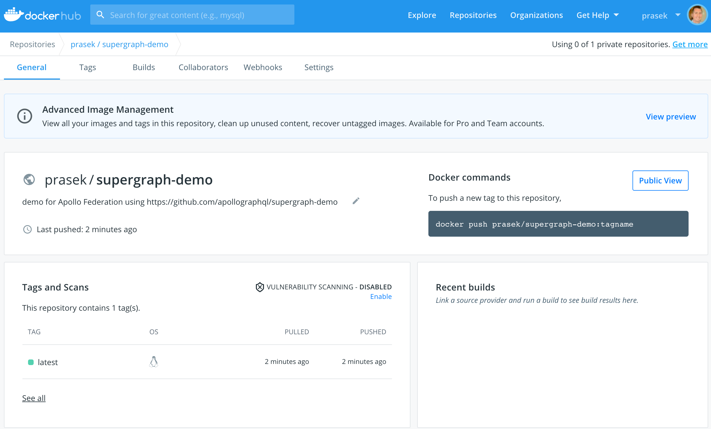

# Supergraph Demo


Moving from dynamic composition to static composition with supergraphs.

Contents:

* [Welcome](#welcome)
* [Prerequisites](#prerequisites)
* [Local Supergraph Composition](#local-supergraph-composition)
* [Composition in Apollo Studio](#composition-in-apollo-studio)
* [Ship Faster Without Breaking Changes](#ship-faster-without-breaking-changes)
* [CI/CD](#cicd)
  * [Overview](#overview)
  * [CI Setup](#ci-setup)
  * [CD: Update Gateway In Place](#cd-update-gateway-in-place)
  * [CD: Immutable Container Deploys](#cd-immutable-container-deploys)
* [Deploying to Kubernetes](#deploying-to-kubernetes)
* [Learn More](#learn-more)

## Welcome

Apollo Federation and Managed Federation have delivered significant
improvements over schema stitching and alternate approaches. Static
composition introduces another big step forward as we move composition out of
the Gateway and into the CI pipeline where federated graph changes can be
validated sooner and built into static artifacts that define how a Gateway
should route requests across the subgraphs in a federation.

Most contemporary federated GraphQL implementations dynamically compose a
list of implementing services (subgraphs) into a GraphQL Gateway at runtime.
There is no static artifact that can be versioned, validated, or reasoned
about across a fleet of Gateway instances that are common in scale-out
federated graph deployments. Gateways often rely on hard-coded behavior for
directives like `join` or accept additional non-GraphQL configuration.

With static composition, you can compose subgraphs into a supergraph at
build-time resulting in a static artifact (supergraph schema) that describes
the machinery to power a graph router at runtime. The supergraph schema
includes directives like `join` that instruct a graph router how federate
multiple subgraphs into a single graph for consumers to use.


See also: [New Federation UX - Docs](https://www.apollographql.com/docs/federation/quickstart/)

## Prerequisites

You'll need:

* [docker](https://docs.docker.com/get-docker/)
* [docker-compose](https://docs.docker.com/compose/install/)
* `rover` [our new CLI](https://www.apollographql.com/docs/rover/getting-started)

To install `rover`:

```sh
curl -sSL https://rover.apollo.dev/nix/latest | sh
```

## Local Supergraph Composition

You can federate multiple subgraphs into a supergraph using:

```sh
make demo
```

Which will do the the following:

```sh
# pull subgraph schemas with federation enrichments
make introspect
```

which gets the subgraph schemas from all subgraph servers:

```
rover subgraph introspect https://nem23xx1vd.execute-api.us-east-1.amazonaws.com/Prod/graphql > subgraphs/orders.graphql

rover subgraph introspect https://7bssbnldib.execute-api.us-east-1.amazonaws.com/Prod/graphql > subgraphs/products.graphql

...
```

```sh
# build a supergraph config file
make config
```

which creates a supergraph.yaml config:

```
.scripts/config.sh > supergraph.yaml
```

```sh
# locally compose a supergraph
make compose
```

which composes a supergraph schema:

```
rover supergraph compose --config ./supergraph.yaml > supergraph.graphql
```

and the graph-router container is started:

```
make docker-up
```

which shows:

```
docker-compose up -d
Creating network "supergraph-demo_default" with the default driver
Creating graph-router ... done

Starting Apollo Gateway in local mode ...
Using local: supergraph.graphql
🚀 Server ready at http://localhost:4000/
```

`make demo` then issues a curl request to the graph router

```sh
make query
```

which issues the following query:

```ts
{
  query: {
    bestSellers: { title }
  }
}
```

and returns this result:

```ts
{
  data: {
    bestSellers:[
      { title: "adidas Yeezy 700 V3 Kyanite" },
      { title: "Jordan 5 Retro Change The World" }
    ]
  }
}
```

`make demo` then shuts down the graph-router:

```sh
make docker-down
```

## Composition in Apollo Studio

[Managed Federation](https://www.apollographql.com/docs/federation/managed-federation/overview/) in Apollo Studio enables teams to independently publish subgraphs to the Apollo Registry, so they can be automatically composed into a supergraph for apps to use.

To get started with Managed Federation, create your Apollo account:

* Signup for a free Team trial: https://studio.apollographql.com/signup
* Create an organization
* **Important:** use the `Team` trial which gives you access Apollo features like `Schema Checks`.

Create a `Graph` of type `Deployed` with the `Federation` option.

Create the `graph-api.env` file with `APOLLO_KEY` using:

```sh
make graph-api-env
```

for use in `docker-compose.managed.yml`:

```yaml
version: '3'
 services:
   web:
     container_name: graph-router
     build: .
     entrypoint: ["node", "index.js"]
     environment:
       - APOLLO_SCHEMA_CONFIG_DELIVERY_ENDPOINT=https://uplink.api.apollographql.com/
     env_file: # create with make graph-api-env
       - graph-api.env
     ports:
       - "4000:4000"
```

`graph-api.env`:

```
APOLLO_KEY=<redacted>
```

Then run the Managed Federation demo:

```sh
make demo-managed
```

Which does the following:

```sh
# pull subgraph schemas with federation enrichments
make introspect
```

Publish your subgraphs to your new `Federated` graph in the Apollo Registry:

```sh
# publish subgraph schemas to a federated graph in the registry, for composition into a managed supergraph
make publish
```

Interim composition errors may surface as each subgraph is published:

```
rover subgraph publish supergraph-demo --routing-url https://nem23xx1vd.execute-api.us-east-1.amazonaws.com/Prod/graphql --schema subgraphs/orders.graphql --name orders

Publishing SDL to supergraph-demo:current (subgraph: orders) using credentials from the default profile.
error: We are unable to run composition for your graph because a subgraph contains an extend declaration for the type 'Product' which does not exist in any subgraph.
```

However once all subgraphs are published the supergraph will be updated, for example:

```
rover subgraph publish supergraph-demo --routing-url https://1kmwbtxfr4.execute-api.us-east-1.amazonaws.com/Prod/graphql --schema subgraphs/locations.graphql --name locations

Publishing SDL to supergraph-demo:current (subgraph: locations) using credentials from the default profile.
A new subgraph called 'locations' for the 'supergraph-demo' graph was created

The gateway for the 'supergraph-demo' graph was updated with a new schema, composed from the updated 'locations' subgraph
```

Viewing the `Federated` graph in Apollo Studio we can see the supergraph and the subgraphs it's composed from:


and finally the graph-router container is started:

```sh
make docker-up-managed
```

which shows:

```
docker-compose -f docker-compose.managed.yml up -d
Creating network "supergraph-demo_default" with the default driver
Creating graph-router ... done

Starting Apollo Gateway in managed mode ...
Apollo usage reporting starting! See your graph at https://studio.apollographql.com/graph/supergraph-preview@current/
🚀 Server ready at http://localhost:4000/
```

`make demo-managed` then issues a curl request to the graph router:

```sh
make query
```

which issues the following query:

```ts
{
  query: {
    bestSellers: { title }
  }
}
```

and returns this result:

```ts
{
  data: {
    bestSellers:[
      { title: "adidas Yeezy 700 V3 Kyanite" },
      { title: "Jordan 5 Retro Change The World" }
    ]
  }
}
```

`make demo-managed` then shuts down the graph router:

```sh
make docker-down
```

With Managed Federation you can leave graph-router running and it will
update automatically when subgraph changes are published and they successfully
compose and pass all schema checks in Apollo Studio:

```sh
make docker-up-managed
```

```
Starting Apollo Gateway in managed mode ...
Apollo usage reporting starting! See your graph at https://studio.apollographql.com/graph/supergraph-preview@current/
🚀 Server ready at http://localhost:4000/
```

## Ship Faster Without Breaking Changes

Apollo Schema Checks help ensure subgraph changes don't break the federated graph, reducing downtime and enabling teams to ship faster.

To simulate a breaking change, add a `Color` `enum` to `.subgraphs/products.graphql`:

```ts
enum Color {
  BLUE
  GREEN
}
```

Then `publish` the changes to the registry:

```sh
make publish
```

Then remove the `Color` `enum` from `.subgraphs/products.graphql`:

```ts
enum Color {
  BLUE
  GREEN
}
```

and do a schema `check` against the published version in the registry:

```sh
make check-products
```

This detects the schema changes, but compares them against the known graph `operations` and determines there is no impact and the changes can be published:

```sh
Checked the proposed subgraph against supergraph-demo@current
Compared 3 schema changes against 2 operations
┌────────┬─────────────────────────┬──────────────────────────────────────────┐
│ Change │          Code           │               Description                │
├────────┼─────────────────────────┼──────────────────────────────────────────┤
│ PASS   │ TYPE_REMOVED            │ type `Color`: removed                    │
├────────┼─────────────────────────┼──────────────────────────────────────────┤
│ PASS   │ VALUE_REMOVED_FROM_ENUM │ enum type `Color`: value `BLUE` removed  │
├────────┼─────────────────────────┼──────────────────────────────────────────┤
│ PASS   │ VALUE_REMOVED_FROM_ENUM │ enum type `Color`: value `GREEN` removed │
└────────┴─────────────────────────┴──────────────────────────────────────────┘
```

Then `publish` the changes and `check` again:

```sh
make publish

make check-products
```

which shows:

```
Checked the proposed subgraph against supergraph-demo@current
There were no changes detected in the composed schema.
```

## CI/CD

### Overview

To enable concurrent service delivery in a multi-team environment, you can shift-left your schema checks to find errors that are often otherwise found at deploy time:

_CI_ for each subgraph:

* on code pull request:
  * `rover subgraph check`
* on config pull request:
  * `rover subgraph check`
* on config merge/push (after the subgraph service has been deployed):
  * `rover subgraph check`
  * `rover subgraph publish`
* [Managed Federation](https://www.apollographql.com/docs/federation/managed-federation/overview/)
  * Runs [schema checks](https://www.apollographql.com/docs/studio/schema-checks/) after each `rover subgraph publish`
  * Composes a supergraph schema if all checks pass
  * Makes the supergraph schema available in the:
    * Registry - for retrieval via `rover supergraph fetch`
    * Uplink - that the Gateway can poll for live updates.

Managed Federation doesn’t publish the composed supergraph schema until composition across all published subgraph succeed and schema checks pass.

With this approach, failed schema checks ([example](https://github.com/apollographql/supergraph-demo/pull/32)) are caught as close to the source of
the change as possible, but only fully validated supergraph schemas are
published for use.


Breaking changes are sometimes intentional, and to accommodate this, Apollo
Studio has the option to mark certain changes as safe in the UI, that provides a
check report URL in your CI, so you can easily navigate to Apollo Studio to:
review the check, mark things safe and then re-run your pipeline.


Publish changes with `rover subgraph publish` which stores a new subgraph schema version to the Apollo Registry, even if schema checks don’t pass. Managed Federation
composes published subgraphs and runs an additional set of
federated schema checks in a globally consistent way before the composed
supergraph schema is made available in the Apollo Registry and to the Apollo Uplink for the Gateway to use.

[Managed Federation](https://www.apollographql.com/docs/federation/managed-federation/overview/) ultimately catches all errors prior to publishing for use:

* CI for multiple concurrent `rover subgraph publish` from multiple service repos
* central point of control & governance
* globally consistent schema checks and composition
* ensures supergraph schema artifact is safe to use before it's published to the Registry

__CD__ for Gateway deployment & update

Once CI has published a new supergraph schema artifact to the Registry it can be deployed via various Gateway _CD_ strategies:

* __(1) Update-in-place (default)__ - the Gateway fleet polls the Apollo Uplink for updates
  * updates in place with no downtime
  * works with all deployment types including VMs, Kubernetes, & Serverless
  * simple update option that helps rollout changes quickly to an existing Gateway fleet
* __(2) Immutable container deployments__ via extended CI & GitOps
  * Gateway container image with embedded supergraph schema when changes detected:
    * [Supergraph build webhooks](https://www.apollographql.com/blog/announcement/webhooks/) - when a new supergraph schema is created
    * `rover supergraph fetch` - to poll the Registry for updates
  * simplifies `BlueGreen` and `Canary` deployment strategies
  * Gateway configuration fully encapsulated in the container image

Both CD options are described in detail below.

### CI Setup

* Create [graph variants](https://www.apollographql.com/docs/studio/org/graphs/) in Apollo Studio for `dev`, `staging`, and `prod`:
* Configure [schema checks](https://www.apollographql.com/docs/studio/schema-checks/) for your graph:
  * [Federated composition checks](https://www.apollographql.com/docs/studio/schema-checks/#federated-composition-checks) will run against the subgraph schemas published to each variant.
  * [Operation checks](https://www.apollographql.com/docs/studio/schema-checks/#types-of-checks) should be configured to validate real world [schema usage](https://www.apollographql.com/docs/studio/check-configurations/#using-apollo-studio-recommended) with usage data from `staging` and `prod` variants.
  * Configure Gateway deployments to provide [usage reporting](https://www.apollographql.com/docs/apollo-server/api/plugin/usage-reporting/#gatsby-focus-wrapper) data for operation checks.

* For each graph variant: `dev`, `staging`, and `prod`:
  * config pull requests: [subgraph-check.yml](https://github.com/apollographql/supergraph-demo/blob/main/.github/workflows/subgraph-check.yml)
    * `rover subgraph check`
  * config merge/push: [subgraph-publish.yml](https://github.com/apollographql/supergraph-demo/blob/main/.github/workflows/subgraph-publish.yml)
    * run after the subgraph service has been deployed
    * `rover subgraph check`
    * `rover subgraph publish`
  * Managed Federation
    * Runs schema checks after each `rover subgraph publish`
    * Composes a supergraph schema if all checks pass
    * Makes the supergraph schema available in the:
      * Registry - for retrieval via `rover supergraph fetch`
      * Uplink - that the Gateway can poll for live updates.

* If you’re in a monorepo:
  * Consider using 3-way merges and [overriding the APOLLO_VCS_COMMIT and/or APOLLO_VCS_BRANCH](https://www.apollographql.com/docs/rover/configuring/#overriding) to correlate schema changes for subgraphs.

### CD: Update Gateway In Place

The default Gateway configuration for Managed Federation is to update the Gateway in place when a new supergraph schema is published to the Uplink. Gateways in the fleet poll the Uplink every 10 seconds by default, so there will be a fast rolling upgrade as Gateways check the Uplink, without the need to restart the Gateway.

Update in place is useful for any long-lived Gateway instance where an immediate update of the Gateway instance's supergraph schema is desired. This is useful for long-lived VMs, Kubernetes `Deployments`, or even Serverless functions that may be cached outside of operator control.

Steps:

* [Configure the Gateways in each fleet](https://www.apollographql.com/docs/federation/managed-federation/setup/#3-modify-the-gateway-if-necessary) (`dev`, `staging`, `prod`) to:
  * pull supergraph schema from their respective graph variants, via the [Apollo Uplink](https://www.apollographql.com/docs/federation/quickstart-pt-2/#managed-federation-basics).
  * provide [usage reporting](https://www.apollographql.com/docs/apollo-server/api/plugin/usage-reporting/#gatsby-focus-wrapper) data for operation checks.

### CD: Immutable Container Deploys

This option produces an immutable Gateway container image with embedded supergraph schema that is most suitable for `BlueGreen` and `Canary` deployments. In this approach a new Gateway `Deployment` is spun up and traffic is shifted from the previous `Deployment` to the current `Deployment` via CD automation or with a Progressive Delivery Controller like [Argo Rollouts](https://argoproj.github.io/argo-rollouts/).

To produce the immutable Gateway container image, this option extends the CI steps above:

1. Detect changes to the supergraph schema built via Managed Federation in Apollo Studio
2. Create a PR to bump [supergraph.graphql](supergraph.graphql) so Git is a source of truth
3. Build/push a Gateway container image with an embedded supergraph schema

CD can then be done with `BlueGreen` and `Canary` deployments, GitOps, and/or other workflows.

#### Extended CI Steps

1. Detecting changes to the supergraph built via Managed Federation

   * Managed Federation builds a supergraph schema after each `rover subgraph publish`
   * Changes detected with the following:
     * [Supergraph build webhooks](https://www.apollographql.com/blog/announcement/webhooks/) - when a new supergraph schema is built in Apollo Studio
     * `rover supergraph fetch` - to poll the Registry

2. `Bump supergraph schema` PR with auto-merge enabled when changes detected
   * Workflow: [supergraph-build-webhook.yml](https://github.com/apollographql/supergraph-demo/blob/main/.github/workflows/supergraph-build-webhook.yml)
   * Commits a new [supergraph.graphql](supergraph.graphql) with the new version from Apollo Studio
   * Additional CI checks on the supergraph schema are required for the PR to merge
   * Auto-merged when CI checks pass

3. Build a Gateway container image with embedded supergraph schema
   * Workflow: [supergraph-gateway-docker-push.yml](https://github.com/apollographql/supergraph-demo/blob/main/.github/workflows/supergraph-gateway-docker-push.yml)
   * Detects changes to `supergraph.graphql` when `Bump supergraph schema` is merged

#### Extended CI Steps (Details)

1. Register the webhook in Apollo Studio in your graph settings
   * Send the webhook to an automation service or serverless function:
   * 

2. Adapt the webhook to a GitHub `repository_dispatch` POST request
   * Create a webhook proxy that passes a `repo` scoped personal access token (PAT)
   * Using a [GitHub machine account](https://github.com/peter-evans/create-pull-request/blob/main/docs/concepts-guidelines.md#workarounds-to-trigger-further-workflow-runs) with limited access:
   * 

3. `repository_dispatch` event triggers a GitHub workflow
   * [supergraph-build-webhook.yml](https://github.com/apollographql/supergraph-demo/blob/main/.github/workflows/supergraph-build-webhook.yml)
   * uses both `repository_dispatch` and `scheduled` to catch any lost webhooks:
   * 

4. GitHub workflow automatically creates a PR with auto-merge enabled
   * [supergraph-build-webhook.yml](https://github.com/apollographql/supergraph-demo/blob/main/.github/workflows/supergraph-build-webhook.yml)
   * using a GitHub action like [Create Pull Request](https://github.com/marketplace/actions/create-pull-request) - see [concepts & guidelines](https://github.com/peter-evans/create-pull-request/blob/main/docs/concepts-guidelines.md)
   * 

5. Docker build/push a new Gateway container image
   * [supergraph-gateway-docker-push.yml](https://github.com/apollographql/supergraph-demo/blob/main/.github/workflows/supergraph-gateway-docker-push.yml)
   * Using this [Dockerfile](Dockerfile)
   * 

6. Gateway image published to DockerHub
   * Container image with embedded supergraph schema published to a container registry:
   * 

Once the new Gateway container image is created an updated `Deployment` manifest can be created and committed to the config repo for the Gateway.

## Deploying to Kubernetes

You'll need:

* [kind](https://kind.sigs.k8s.io/docs/user/quick-start/#installation)

then run:

```sh
make demo-k8s
```

which creates:

* local k8s cluster with the Ambassador Ingress Controller
* graph-router `Deployment` with 3 replicas, a `Service`, and an `Ingress`

using [k8s/router.yaml](k8s/router.yaml):

```yaml
apiVersion: apps/v1
kind: Deployment
metadata:
  name: graph-router
  labels:
    app: graphql
spec:
  replicas: 3
  selector:
    matchLabels:
      app: graphql
  template:
    metadata:
      labels:
        app: graphql
    spec:
      containers:
      - name: gateway
        image: prasek/supergraph-demo:latest
        env:
        - name: GATEWAY_PORT
          value: "3999"
        - name: GATEWAY_ENV
          value: "Prod"
        - name: GATEWAY_SUPERGRAPH_SDL
          value: "supergraph.graphql"
        ports:
        - containerPort: 3999
---
apiVersion: v1
kind: Service
metadata:
  name: graphql-service
spec:
  selector:
    app: graphql
  ports:
    - protocol: TCP
      port: 4001
      targetPort: 3999
---
apiVersion: networking.k8s.io/v1
kind: Ingress
metadata:
  name: graphql-ingress
  annotations:
    kubernetes.io/ingress.class: ambassador
spec:
  rules:
  - http:
      paths:
      - path: /
        pathType: Prefix
        backend:
          service:
            name: graphql-service
            port:
              number: 4001
```

`make demo-k8s` then runs the following in a loop until the query succeeds or 2 min timeout:

```sh
kubectl get all
make k8s-query
```

Interim results while services are starting:

```
NAME                                READY   STATUS              RESTARTS   AGE
pod/graph-router-6c64bf96f4-k9bcj   0/1     ContainerCreating   0          4s
pod/graph-router-6c64bf96f4-ks6l4   0/1     ContainerCreating   0          4s
pod/graph-router-6c64bf96f4-wkgtq   0/1     ContainerCreating   0          4s

NAME                      TYPE        CLUSTER-IP     EXTERNAL-IP   PORT(S)    AGE
service/graphql-service   ClusterIP   10.96.70.100   <none>        4001/TCP   4s
service/kubernetes        ClusterIP   10.96.0.1      <none>        443/TCP    106s

NAME                           READY   UP-TO-DATE   AVAILABLE   AGE
deployment.apps/graph-router   0/3     3            0           4s

NAME                                      DESIRED   CURRENT   READY   AGE
replicaset.apps/graph-router-6c64bf96f4   3         3         0       4s
Smoke test
-------------------------------------------------------------------------------------------
curl -X POST -H "Content-Type: application/json" --data '{ "query": "{ bestSellers { title } } " }' http://localhost:80/
  % Total    % Received % Xferd  Average Speed   Time    Time     Time  Current
                                 Dload  Upload   Total   Spent    Left  Speed
100    41    0     0  100    41      0   6833 --:--:-- --:--:-- --:--:--  6833
curl: (52) Empty reply from server

Error: query failed
 - got:
 - expecting:{"data":{"bestSellers":[{"title":"Hello World"},{"title":"Hello World"}]}}
-------------------------------------------------------------------------------------------
```

Success after services are started:

```
NAME                                READY   STATUS    RESTARTS   AGE
pod/graph-router-6c64bf96f4-k9bcj   1/1     Running   0          45s
pod/graph-router-6c64bf96f4-ks6l4   1/1     Running   0          45s
pod/graph-router-6c64bf96f4-wkgtq   1/1     Running   0          45s

NAME                      TYPE        CLUSTER-IP     EXTERNAL-IP   PORT(S)    AGE
service/graphql-service   ClusterIP   10.96.70.100   <none>        4001/TCP   45s
service/kubernetes        ClusterIP   10.96.0.1      <none>        443/TCP    2m27s

NAME                           READY   UP-TO-DATE   AVAILABLE   AGE
deployment.apps/graph-router   3/3     3            3           45s

NAME                                      DESIRED   CURRENT   READY   AGE
replicaset.apps/graph-router-6c64bf96f4   3         3         3       45s
Smoke test
-------------------------------------------------------------------------------------------
curl -X POST -H "Content-Type: application/json" --data '{ "query": "{ bestSellers { title } } " }' http://localhost:80/
  % Total    % Received % Xferd  Average Speed   Time    Time     Time  Current
                                 Dload  Upload   Total   Spent    Left  Speed
100   116  100    75  100    41     36     20  0:00:02  0:00:02 --:--:--    56
{"data":{"bestSellers":[{"title":"Hello World"},{"title":"Hello World"}]}}
Success!
-------------------------------------------------------------------------------------------
```

`make demo-k8s` then cleans up:

```
deployment.apps "graph-router" deleted
service "graphql-service" deleted
ingress.networking.k8s.io "graphql-ingress" deleted
Deleting cluster "kind" ...
```

## Learn More

Apollo tools and services help you develop, maintain, operate, and scale your data graph.

Learn more about schema checks and how Apollo can help your teams ship faster here: https://www.apollographql.com/docs/studio/.
