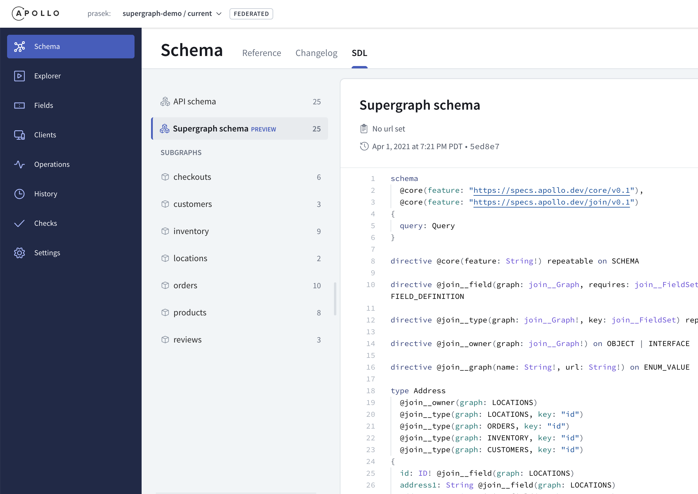
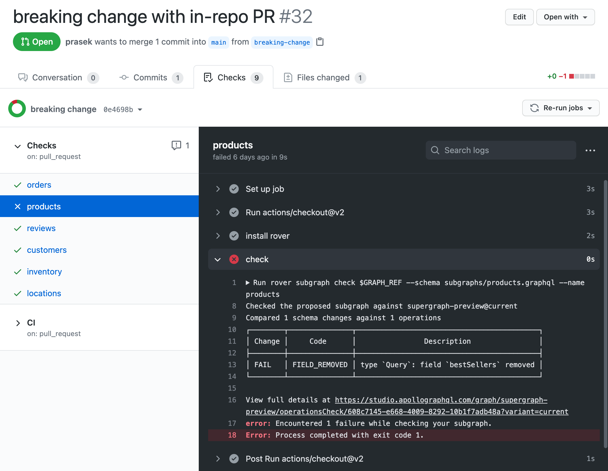
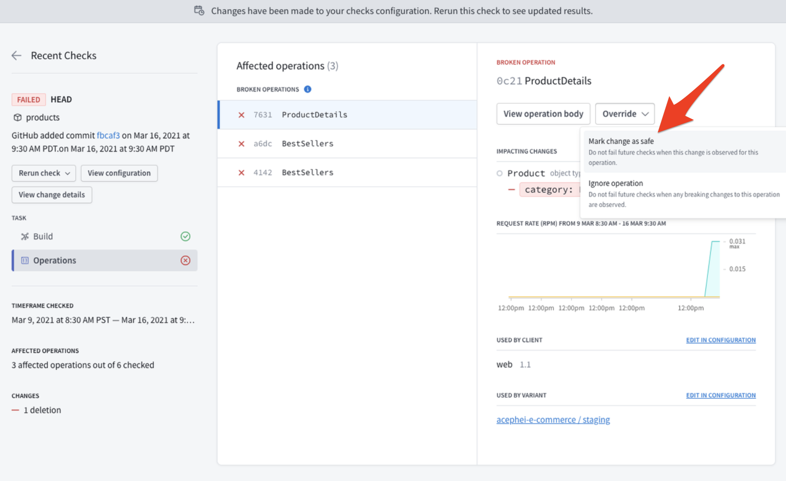

# Supergraph Demo


[](https://renovatebot.com)

> 📣 [Apollo Federation 2 is generally available](https://www.apollographql.com/blog/announcement/backend/apollo-federation-2-is-now-generally-available/)!
View the [Federation 2 demo](https://github.com/apollographql/supergraph-demo-fed2/blob/main/README.md)!

Moving from dynamic composition to static composition with supergraphs.

Contents:

* [Welcome](#welcome)
* [Prerequisites](#prerequisites)
* [Local Development](#local-development)
  * [Local Supergraph Composition](#local-supergraph-composition)
  * [Apollo Sandbox for Local Development](#apollo-sandbox-for-local-development)
  * [Tracing with Open Telemetry](#tracing-with-open-telemetry)
* [Apollo Studio](#apollo-studio)
  * [Composition in Apollo Studio](#composition-in-apollo-studio)
  * [Ship Faster Without Breaking Changes](#ship-faster-without-breaking-changes)

* [Standard CI/CD](#standard-cicd)
  * [Subgraph CI](#subgraph-ci)
  * [Subgraph Deployment](#subgraph-deployment)
  * [Gateway CI](#gateway-ci)
  * [Gateway Deployment](#gateway-deployment)
* [Deployment Examples](#deployment-examples)
  * [Kubernetes with Supergraph ConfigMap](#kubernetes-with-supergraph-configmap)
  * [Serverless](#serverless)
* [Apollo Router](#apollo-router)
* [Learn More](#learn-more)

See also:
- [apollographql/supergraph-demo-fed2](https://github.com/apollographql/supergraph-demo-fed2/blob/main/README.md)
- [apollographql/supergraph-demo-k8s-graph-ops](https://github.com/apollographql/supergraph-demo-k8s-graph-ops)

## Welcome

[Apollo Federation](https://www.apollographql.com/docs/federation/) and [Managed Federation](https://www.apollographql.com/docs/federation/managed-federation/overview/) have delivered significant
improvements over schema stitching and alternate approaches. Static
composition introduces another big step forward as we move composition out of
the Gateway and into the CI pipeline where federated graph changes can be
validated sooner and built into static artifacts that define how a Gateway
should route requests across the subgraphs in a federation.

Most contemporary federated GraphQL implementations dynamically compose a
list of implementing services (subgraphs) into a GraphQL Gateway at runtime.
There is no static artifact that can be versioned, validated, or reasoned
about across a fleet of Gateway instances that are common in scale-out
federated graph deployments. Gateways often rely on hard-coded behavior for
directives like `join` or accept additional non-GraphQL configuration.

With static composition, you can compose subgraphs into a supergraph at
build-time resulting in a static artifact (supergraph schema) that describes
the machinery to power a graph router at runtime. The supergraph schema
includes directives like `join` that instruct a graph router how federate
multiple subgraphs into a single graph for consumers to use.


See also: [New Federation UX - Docs](https://www.apollographql.com/docs/federation/quickstart/)

## Prerequisites

You'll need:

* [docker](https://docs.docker.com/get-docker/)
* [docker-compose](https://docs.docker.com/compose/install/)
* `rover` [our new CLI](https://www.apollographql.com/docs/rover/getting-started)

To install `rover`:

```sh
curl -sSL https://rover.apollo.dev/nix/latest | sh
```

## Local Development

### Local Supergraph Composition

See also: [Apollo Federation docs](https://www.apollographql.com/docs/federation/quickstart/)

You can federate multiple subgraphs into a supergraph using:

```sh
make demo
```

which does the following:

```sh
# build a supergraph from 3 subgraphs: products, users, inventory
make supergraph
```

which runs:

```
rover supergraph compose --config ./supergraph.yaml > supergraph.graphql
```

and then runs:

```
docker-compose up -d

Creating apollo-gateway ... done
Creating inventory ... done
Creating users     ... done
Creating products  ... done

Starting Apollo Gateway in local mode ...
Using local: supergraph.graphql
🚀 Graph Router ready at http://localhost:4000/
```

`make demo` then issues a curl request to the graph router via:

```sh
make query
```

which issues the following query that fetches across 3 subgraphs:

```ts
query Query {
  allProducts {
    id
    sku
    createdBy {
      email
      totalProductsCreated
    }
  }
}
```

with results like:

```ts
{
  data: {
    allProducts: [
      {
        id: "apollo-federation",
        sku: "federation",
        createdBy: {
          email: "support@apollographql.com",
          totalProductsCreated: 1337
        }
      },{
        id: "apollo-studio",
        sku: "studio",
        createdBy:{
          email: "support@apollographql.com",
          totalProductsCreated: 1337
        }
      }
    ]
  }
}
```

`make demo` then shuts down the graph router:

```
docker-compose down
```

### Apollo Sandbox for Local Development

#### Deploy Graph

```
make docker-up
```

#### Query using Apollo Sandbox

1. Open [http://localhost:4000/](http://localhost:4000/)
2. Click `Query your server`
3. Run a query:

```ts
query Query {
  allProducts {
    id
    sku
    createdBy {
      email
      totalProductsCreated
    }
  }
}
```

View results:


#### Cleanup

```
make docker-down
```

### Tracing with Open Telemetry

#### Deploy Graph with Open Telemetry Collector

```
make docker-up-otel-collector
```

#### Run Queries

```
make smoke
```

#### View Open Telemetry Traces

browse to [http://localhost:9411/](http://localhost:9411/)


#### Cleanup

```
make docker-down-otel-collector
```

#### Send Open Telemetry Traces to Honeycomb

You can send Open Telemetry from the Gateway to Honeycomb with the following [collector-config.yml](opentelemetry/collector-config.yml):

```
receivers:
  otlp:
    protocols:
      grpc:
      http:
        cors_allowed_origins:
          - http://*
          - https://*

exporters:
  otlp:
    endpoint: "api.honeycomb.io:443"
    headers:
      "x-honeycomb-team": "your-api-key"
      "x-honeycomb-dataset": "your-dataset-name"

service:
  pipelines:
    traces:
      receivers: [otlp]
      exporters: [otlp]
```


#### Learn More

* Docs: [Open Telemetry for Apollo Federation](https://www.apollographql.com/docs/federation/opentelemetry/)
* Docker compose file: [docker-compose.otel-collector.yml](docker-compose.otel-collector.yml)
* Helper library: [supergraph-demo-opentelemetry](https://github.com/prasek/supergraph-demo-opentelemetry)
  * See usage in:
    * [gateway/gateway.js](gateway/gateway.js)
    * [subgraphs/products/products.js](subgraphs/products/products.js)

## Apollo Studio

### Composition in Apollo Studio

See also: [Apollo Studio docs](https://www.apollographql.com/docs/federation/quickstart-pt-2/)

[Managed Federation](https://www.apollographql.com/docs/federation/managed-federation/overview/) in Apollo Studio enables teams to independently publish subgraphs to the Apollo Registry, so they can be automatically composed into a supergraph for apps to use.

#### Create a Federated Graph in Apollo Studio

To get started with Managed Federation, create your Apollo account:

* Signup for a free Team trial: https://studio.apollographql.com/signup
* Create an organization
* **Important:** use the `Team` trial which gives you access Apollo features like `Schema Checks`.

Then create a `Graph` of type `Deployed` with the `Federation` option.

Once you have created your graph in Apollo Studio, run the following:

```sh
make demo-managed
```

#### Connect to your Graph in Apollo Studio

which will prompt for your `graph key` and `graph ref` and save them to `./graph-api.env`:

* `graph key` - the graph API key used to authenticate with Apollo Studio.
* `graph ref` - a reference to the graph in Apollo's registry the graph router should pull from.
  * in the form `<graph-id>@<variant>`
  * `@<variant>` is optional and will default to `@current`
  * examples: `my-graph@dev`, `my-graph@stage`, `my-graph@prod`
* see [configuration reference](https://www.apollographql.com/docs/apollo-server/api/apollo-server/#apollo) for details.

Note: The generated `./graph-api.env` holds your `APOLLO_KEY` and `APOLLO_GRAPH_REF`.

#### Publish Subgraph Schemas to the Apollo Registry

`make demo-managed` will publish the `subgraphs/**.graphql` schemas to your new `Federated` graph in the Apollo Registry, which performs managed composition and schema checks, to prevent breaking changes:

```sh
make publish
```

Temporary composition errors may surface as each subgraph is published:

```
+ rover subgraph publish supergraph-router@dev --routing-url http://products:4000/graphql --schema subgraphs/products/products.graphql --name products

Publishing SDL to supergraph-router:dev (subgraph: products) using credentials from the default profile.

A new subgraph called 'products' for the 'supergraph-router' graph was created.

The gateway for the 'supergraph-router' graph was NOT updated with a new schema

WARN: The following composition errors occurred:
Unknown type "User".
[products] Query -> `Query` is an extension type, but `Query` is not defined in any service
```

Success! Once all subgraphs are published the supergraph will be updated, for example:

```
+ rover subgraph publish supergraph-router@dev --routing-url https://users:4000/graphql --schema subgraphs/users/users.graphql --name users

Publishing SDL to supergraph-router:dev (subgraph: users) using credentials from the default profile.

A new subgraph called 'users' for the 'supergraph-router' graph was created

The gateway for the 'supergraph-router' graph was updated with a new schema, composed from the updated 'users' subgraph
```

Viewing the `Federated` graph in Apollo Studio we can see the supergraph and the subgraphs it's composed from:


#### Run the Graph Router and Subgraph Containers

The graph router and subgraph services will be started by `make demo-managed` next.

using `docker-compose.managed.yml`:

```yaml
version: '3'
services:
  apollo-gateway:
    container_name: apollo-gateway
    build: ./gateway
    environment:
      - APOLLO_SCHEMA_CONFIG_DELIVERY_ENDPOINT=https://uplink.api.apollographql.com/
    env_file: # created with: make graph-api-env
      - graph-api.env
    ports:
      - "4000:4000"
  products:
    container_name: products
    build: ./subgraphs/products
  inventory:
    container_name: inventory
    build: ./subgraphs/inventory
  users:
    container_name: users
    build: ./subgraphs/users
```

```sh
make docker-up-managed
```

which shows:

```
docker-compose -f docker-compose.managed.yml up -d
Creating network "supergraph-demo_default" with the default driver
Creating apollo-gateway ... done

Starting Apollo Gateway in managed mode ...
Apollo usage reporting starting! See your graph at https://studio.apollographql.com/graph/supergraph-router@dev/
🚀 Server ready at http://localhost:4000/
```

#### Make a Federated Query

`make demo-managed` then issues a curl request to the graph router:

```sh
make query
```

which has the same query and response as above.

#### Clean Up

`make demo-managed` then shuts down the graph router:

```sh
make docker-down
```

### Ship Faster Without Breaking Changes

See also: [working with subgraphs docs](https://www.apollographql.com/docs/federation/quickstart-pt-3/)

Apollo Schema Checks help ensure subgraph changes don't break the federated graph, reducing downtime and enabling teams to ship faster.

#### The Graph Router will Update In Place

With Managed Federation you can leave the graph router running and it will
update automatically when subgraph changes are published and they successfully
compose and pass all schema checks in Apollo Studio:

```sh
make docker-up-managed
```

```
Starting Apollo Gateway in managed mode ...
Apollo usage reporting starting! See your graph at https://studio.apollographql.com/graph/supergraph-router@dev/
🚀 Server ready at http://localhost:4000/
```

#### Simulating a Change to the Product Subgraph

To simulate a change to the products subgraph, add a `Color` `enum` to `.subgraphs/products.graphql`:

```ts
enum Color {
  BLUE
  GREEN
}
```

Then `publish` the changes to the registry:

```sh
make publish
```

Then remove the `Color` `enum` from `.subgraphs/products.graphql`:

```ts
enum Color {
  BLUE
  GREEN
}
```

#### Run a Schema Check

Run a schema `check` against the published version in the registry:

```sh
make check-products
```

This detects the schema changes and compares them against the known graph `operations` to determine that even though there are schema changes, there is no impact to actual operations so changes can be safely published:

```sh
Checked the proposed subgraph against supergraph-demo@current
Compared 3 schema changes against 2 operations
┌────────┬─────────────────────────┬──────────────────────────────────────────┐
│ Change │          Code           │               Description                │
├────────┼─────────────────────────┼──────────────────────────────────────────┤
│ PASS   │ TYPE_REMOVED            │ type `Color`: removed                    │
├────────┼─────────────────────────┼──────────────────────────────────────────┤
│ PASS   │ VALUE_REMOVED_FROM_ENUM │ enum type `Color`: value `BLUE` removed  │
├────────┼─────────────────────────┼──────────────────────────────────────────┤
│ PASS   │ VALUE_REMOVED_FROM_ENUM │ enum type `Color`: value `GREEN` removed │
└────────┴─────────────────────────┴──────────────────────────────────────────┘
```

#### Publish Validated Subgraph Schemas to Apollo Registry

Then `publish` the changes and `check` again:

```sh
make publish

make check-products
```

which shows:

```
Checked the proposed subgraph against supergraph-demo@current
There were no changes detected in the composed schema.
```

#### Recap

Using `rover` in a local dev environment helps catch potentially breaking changes sooner. The next section covers how `rover` can be integrated into your CI/CD environments, and how Managed Federation catches breaking changes before they are delivered to the graph router.

## Standard CI/CD

This example repo is a monorepo, but this same basic CI/CD workflow applies for single-repo-per-package scenarios.

### Subgraph CI

* Create [graph variants](https://www.apollographql.com/docs/studio/org/graphs/) in Apollo Studio for `dev`, `staging`, and `prod`:
* Configure [schema checks](https://www.apollographql.com/docs/studio/schema-checks/) for your graph:
  * [Federated composition checks](https://www.apollographql.com/docs/studio/schema-checks/#federated-composition-checks) will run against the subgraph schemas published to each variant.
  * [Operation checks](https://www.apollographql.com/docs/studio/schema-checks/#types-of-checks) should be configured to validate real world [schema usage](https://www.apollographql.com/docs/studio/check-configurations/#using-apollo-studio-recommended) with usage data from `staging` and `prod` variants.
  * Configure Gateway deployments to provide [usage reporting](https://www.apollographql.com/docs/apollo-server/api/plugin/usage-reporting/#gatsby-focus-wrapper) data for operation checks.
  * CI for each subgraph for source pull requests: [subgraph-check.yml](https://github.com/apollographql/supergraph-demo/blob/main/.github/workflows/subgraph-check.yml)
    * `rover subgraph check`
    * schema checks against schema in the `dev` variant
    * operation checks against usage data in the `prod` and typically `stage` variants.

* If you’re in a monorepo:
  * Consider using 3-way merges and [overriding the APOLLO_VCS_COMMIT and/or APOLLO_VCS_BRANCH](https://www.apollographql.com/docs/rover/configuring/#overriding) to correlate schema changes for subgraph changes.

With this approach, failed schema checks ([example](https://github.com/apollographql/supergraph-demo/pull/32)) are caught as close to the source of
the change as possible, but only fully validated supergraph schemas are
published for use.



Breaking changes are sometimes intentional, and to accommodate this, Apollo
Studio has the option to mark certain changes as safe in the UI, that provides a
check report URL in your CI, so you can easily navigate to Apollo Studio to:
review the check, mark things safe and then re-run your pipeline.



### Subgraph Deployment

* Run a deployment workflow like this simple example [subgraph-deploy-publish.yml](https://github.com/apollographql/supergraph-demo/blob/main/.github/workflows/subgraph-deploy-publish.yml)
  * Before subgraph deployment
    * Do a reality check with `rover subgraph check`
  * Deploy subgraph service
    * Should have the service deployed before publishing the subgraph schema
  * After subgraph deployment
    * Publish the subgraph schema to the registry with `rover subgraph publish`
    * Managed Federation will run central schema checks and operation check and  publish a new supergraph schema for the Gateways in the fleet for each environment

Publishing subgraph schema changes with `rover subgraph publish` always stores a new subgraph schema version to the Apollo Registry, even if schema checks don’t pass.

[Managed Federation](https://www.apollographql.com/docs/federation/managed-federation/overview/) ultimately catches all breaking changes prior before a new supergraph schema is published:

* Runs schema checks after each `rover subgraph publish`
* Composes a supergraph schema if all checks pass
* Makes the supergraph schema available in the:
  * `Apollo Uplink` - that the Gateway can poll for live updates (default).
  * `Apollo Registry` - for retrieval via `rover supergraph fetch`.
  * `Apollo Supergraph Build Webhook` - for custom integrations

Key benefits to Managed Federation:

* CI for multiple concurrent `rover subgraph publish` from multiple service repos
* Central point of control & governance
* Globally consistent schema checks and composition
* Catches breaking changes at supergraph build time before a new supergraph is published, before they're published for Gateways to use.

### Gateway CI

The Gateway image and configuration can be managed using standard CI practices.

For example, if using Docker images:

* see [example monorepo release workflow](https://github.com/apollographql/supergraph-demo/blob/main/.github/workflows/release.yml)
* bumps package versions in this `source repo`
* build & push Gateway docker images to DockerHub

### Gateway Deployment

The default configuration for the Gateway is to update in place by pulling new supergraph schema versions as they're published to the Apollo Uplink. Gateways in the fleet poll the Uplink every 10 seconds by default, so there will be a fast rolling upgrade as Gateways check the Uplink, without the need to restart the Gateway.

Update in place is useful for any long-lived Gateway instance where an immediate update of the Gateway instance's supergraph schema is desired. 

Update-in-place with Managed Federation is useful for:
* long-lived VMs
* Kubernetes `Deployments`
* Serverless functions that may be cached outside of operator control.

[Configure the Gateways in each fleet](https://www.apollographql.com/docs/federation/managed-federation/setup/#3-modify-the-gateway-if-necessary) `dev`, `staging`, `prod` to:

* pull supergraph schema from their respective graph variants, via the [Apollo Uplink](https://www.apollographql.com/docs/federation/quickstart-pt-2/#managed-federation-basics).
* provide [usage reporting](https://www.apollographql.com/docs/apollo-server/api/plugin/usage-reporting/#gatsby-focus-wrapper) data for operation checks.

### Custom Gateway Deployments

You can do custom CD with the following hooks and the `rover` CLI:

* [supergraph build webhook](https://www.apollographql.com/blog/announcement/webhooks/) - pushes from Managed Federation.
* `rover supergraph fetch` - pulls from the `Apollo Registry`.

See [Kubernetes-native GraphOps](https://github.com/apollographql/supergraph-demo-k8s-graph-ops) to learn more about using custom CD with Kubernetes and GitOps.

## Deployment Examples

### Kubernetes with Supergraph ConfigMap

You'll need the latest versions of:

* [kubectl](https://kubernetes.io/docs/tasks/tools/) - with expanded `kustomize` support for `resources`
* [kind](https://kind.sigs.k8s.io/docs/user/quick-start/#installation)

then run:

```sh
make demo-k8s
```

which generates a graph router `Deployment` and supergraph `ConfigMap` using:

```
kubectl kustomize k8s/router/base
```

and then creates:

* local k8s cluster with the NGINX Ingress Controller
* graph-router `Deployment` configured to use a supergraph `ConfigMap`
* graph-router `Service` and `Ingress`

### Gateway Deployment with Supergraph ConfigMap

using [k8s/router/base/router.yaml](k8s/router/base/router.yaml) via:

```sh
kubectl apply -k k8s/router/base
```

```yaml
apiVersion: apps/v1
kind: Deployment
metadata:
  labels:
    app: router
  name: router-deployment
spec:
  replicas: 1
  selector:
    matchLabels:
      app: router
  template:
    metadata:
      labels:
        app: router
    spec:
      containers:
      - env:
        - name: APOLLO_SCHEMA_CONFIG_EMBEDDED
          value: "true"
        image: prasek/supergraph-router:latest
        name: router
        ports:
        - containerPort: 4000
        volumeMounts:
        - mountPath: /etc/config
          name: supergraph-volume
      volumes:
      - configMap:
          name: supergraph-c22698b7b9
        name: supergraph-volume
---
apiVersion: v1
kind: ConfigMap
metadata:
  name: supergraph-c22698b7b9
data:
  supergraph.graphql: |
    schema
      @core(feature: "https://specs.apollo.dev/core/v0.1"),
      @core(feature: "https://specs.apollo.dev/join/v0.1")
    {
      query: Query
    }

    ...

    enum join__Graph {
      INVENTORY @join__graph(name: "inventory" url: "http://inventory:4000/graphql")
      PRODUCTS @join__graph(name: "products" url: "http://products:4000/graphql")
      USERS @join__graph(name: "users" url: "https://users:4000/graphql")
    }

    type Product
      @join__owner(graph: PRODUCTS)
      @join__type(graph: PRODUCTS, key: "id")
      @join__type(graph: PRODUCTS, key: "sku package")
      @join__type(graph: PRODUCTS, key: "sku variation{id}")
      @join__type(graph: INVENTORY, key: "id")
    {
      id: ID! @join__field(graph: PRODUCTS)
      sku: String @join__field(graph: PRODUCTS)
      package: String @join__field(graph: PRODUCTS)
      variation: ProductVariation @join__field(graph: PRODUCTS)
      dimensions: ProductDimension @join__field(graph: PRODUCTS)
      createdBy: User @join__field(graph: PRODUCTS, provides: "totalProductsCreated")
      delivery(zip: String): DeliveryEstimates @join__field(graph: INVENTORY, requires: "dimensions{size weight}")
    }

    type ProductDimension {
      size: String
      weight: Float
    }

    type ProductVariation {
      id: ID!
    }

    type Query {
      allProducts: [Product] @join__field(graph: PRODUCTS)
      product(id: ID!): Product @join__field(graph: PRODUCTS)
    }

    type User
      @join__owner(graph: USERS)
      @join__type(graph: USERS, key: "email")
      @join__type(graph: PRODUCTS, key: "email")
    {
      email: ID! @join__field(graph: USERS)
      name: String @join__field(graph: USERS)
      totalProductsCreated: Int @join__field(graph: USERS)
    }
---
apiVersion: v1
kind: Service
metadata:
  name: router-service
spec:
  ports:
  - port: 4000
    protocol: TCP
    targetPort: 4000
  selector:
    app: router
---
apiVersion: networking.k8s.io/v1
kind: Ingress
metadata:
  annotations:
    kubernetes.io/ingress.class: nginx
  name: router-ingress
spec:
  rules:
  - http:
      paths:
      - backend:
          service:
            name: router-service
            port:
              number: 4000
        path: /
        pathType: Prefix
```

and 3 subgraph services [k8s/subgraphs/base/subgraphs.yaml](k8s/subgraphs/base/subgraphs.yaml) via:

```sh
kubectl kustomize k8s/subgraphs/base
```

### Make a GraphQL Query

`make demo-k8s` then runs the following in a loop until the query succeeds or 2 min timeout:

```sh
kubectl get all
make k8s-query
```

which shows the following:

```
NAME                                     READY   STATUS    RESTARTS   AGE
pod/inventory-65494cbf8f-bhtft           1/1     Running   0          59s
pod/products-6d75ff449c-9sdnd            1/1     Running   0          59s
pod/router-deployment-84cbc9f689-8fcnf   1/1     Running   0          20s
pod/users-d85ccf5d9-cgn4k                1/1     Running   0          59s

NAME                     TYPE        CLUSTER-IP      EXTERNAL-IP   PORT(S)    AGE
service/inventory        ClusterIP   10.96.108.120   <none>        4000/TCP   59s
service/kubernetes       ClusterIP   10.96.0.1       <none>        443/TCP    96s
service/products         ClusterIP   10.96.65.206    <none>        4000/TCP   59s
service/router-service   ClusterIP   10.96.178.206   <none>        4000/TCP   20s
service/users            ClusterIP   10.96.98.53     <none>        4000/TCP   59s

NAME                                READY   UP-TO-DATE   AVAILABLE   AGE
deployment.apps/inventory           1/1     1            1           59s
deployment.apps/products            1/1     1            1           59s
deployment.apps/router-deployment   1/1     1            1           20s
deployment.apps/users               1/1     1            1           59s

NAME                                           DESIRED   CURRENT   READY   AGE
replicaset.apps/inventory-65494cbf8f           1         1         1       59s
replicaset.apps/products-6d75ff449c            1         1         1       59s
replicaset.apps/router-deployment-84cbc9f689   1         1         1       20s
replicaset.apps/users-d85ccf5d9                1         1         1       59s
Smoke test
-------------------------------------------------------------------------------------------
++ curl -X POST -H 'Content-Type: application/json' --data '{ "query": "{ allProducts { id, sku, createdBy { email, totalProductsCreated } } }" }' http://localhost:80/
  % Total    % Received % Xferd  Average Speed   Time    Time     Time  Current
                                 Dload  Upload   Total   Spent    Left  Speed
100   352  100   267  100    85   3000    955 --:--:-- --:--:-- --:--:--  3911
{"data":{"allProducts":[{"id":"apollo-federation","sku":"federation","createdBy":{"email":"support@apollographql.com","totalProductsCreated":1337}},{"id":"apollo-studio","sku":"studio","createdBy":{"email":"support@apollographql.com","totalProductsCreated":1337}}]}}
Success!
-------------------------------------------------------------------------------------------
```

### Cleanup

`make demo-k8s` then cleans up:

```
deployment.apps "graph-router" deleted
service "graphql-service" deleted
ingress.networking.k8s.io "graphql-ingress" deleted
Deleting cluster "kind" ...
```

## Serverless

See [serverless.yml](serverless/serverless.yml)

```
make demo-serverless
```

which does the following:

```
rover supergraph compose --config serverless/supergraph.yaml > serverless/supergraph.graphql
docker-compose -f docker-compose.serverless.yml up -d
Creating network "supergraph-demo_default" with the default driver
Creating serverless ... done
docker-compose -f docker-compose.serverless.yml logs
Attaching to serverless
serverless    | Serverless: Running "serverless" installed locally (in service node_modules)
serverless    | offline: Starting Offline: dev/us-east-1.
serverless    | offline: Offline [http for lambda] listening on http://0.0.0.0:3002
serverless    | offline: Function names exposed for local invocation by aws-sdk:
serverless    |            * router: supergraph-serverless-dev-router
serverless    |            * inventory: supergraph-serverless-dev-inventory
serverless    |            * products: supergraph-serverless-dev-products
serverless    |            * users: supergraph-serverless-dev-users
serverless    |
serverless    |  ┌───────────────────────────────────────────────────────────────────────────┐
serverless    |  │                                                                           │
serverless    |  │   ANY | http://0.0.0.0:4000/                                              │
serverless    |  │   POST | http://0.0.0.0:4000/2015-03-31/functions/router/invocations      │
serverless    |  │   ANY | http://0.0.0.0:4000/inventory                                     │
serverless    |  │   POST | http://0.0.0.0:4000/2015-03-31/functions/inventory/invocations   │
serverless    |  │   ANY | http://0.0.0.0:4000/products                                      │
serverless    |  │   POST | http://0.0.0.0:4000/2015-03-31/functions/products/invocations    │
serverless    |  │   ANY | http://0.0.0.0:4000/users                                         │
serverless    |  │   POST | http://0.0.0.0:4000/2015-03-31/functions/users/invocations       │
serverless    |  │                                                                           │
serverless    |  └───────────────────────────────────────────────────────────────────────────┘
serverless    |
serverless    | offline: [HTTP] server ready: http://0.0.0.0:4000 🚀
serverless    | offline:
serverless    | offline: Enter "rp" to replay the last request
-------------------------------------------------------------------------------------------
++ curl -X POST -H 'Content-Type: application/json' --data '{ "query": "{allProducts{id,sku,createdBy{email,totalProductsCreated}}}" }' http://localhost:4000/
  % Total    % Received % Xferd  Average Speed   Time    Time     Time  Current
                                 Dload  Upload   Total   Spent    Left  Speed
100   341  100   267  100    74    331     91 --:--:-- --:--:-- --:--:--   423

Result:
{"data":{"allProducts":[{"id":"apollo-federation","sku":"federation","createdBy":{"email":"support@apollographql.com","totalProductsCreated":1337}},{"id":"apollo-studio","sku":"studio","createdBy":{"email":"support@apollographql.com","totalProductsCreated":1337}}]}}
-------------------------------------------------------------------------------------------
docker-compose -f docker-compose.serverless.yml down
Stopping serverless ... done
Removing serverless ... done
Removing network supergraph-demo_default
```

## Apollo Router

[The Apollo Router](https://www.apollographql.com/blog/announcement/backend/apollo-router-our-graphql-federation-runtime-in-rust) is our next-generation GraphQL Federation runtime written in Rust, and it is fast.

As a Graph Router, the Apollo Router plays the same role as the Apollo Gateway. The same subgraph schemas and composed supergraph schema can be used in both the Router and the Gateway.

This demo shows using the Apollo Router with a Federation 1 supergraph schema, composed using the Fed 1 `rover supergraph compose` command. To see the Router working with Federation 2 composition, checkout the Apollo Router section of [apollographql/supergraph-demo-fed2](https://github.com/apollographql/supergraph-demo-fed2/blob/main/README.md#apollo-router).

[Early benchmarks](https://www.apollographql.com/blog/announcement/backend/apollo-router-our-graphql-federation-runtime-in-rust) show that the Router adds less than 10ms of latency to each operation, and it can process 8x the load of the JavaScript Apollo Gateway.

To get started with the Router:

```
make demo-local-router
```

this uses a simple [docker-compose.router.yml](docker-compose.router.yml) file:
```yaml
version: '3'
services:
  apollo-router:
    container_name: apollo-router
    build: ./router
    volumes:
      - ./supergraph.graphql:/etc/config/supergraph.graphql
      - ./router/configuration.yaml:/etc/config/configuration.yaml
    ports:
      - "4000:4000"
  products:
    container_name: products
    build: ./subgraphs/products
  inventory:
    container_name: inventory
    build: ./subgraphs/inventory
  users:
    container_name: users
    build: ./subgraphs/users
```

which uses the following [Dockerfile](router/Dockerfile)
```
from ubuntu

WORKDIR /usr/src/app
RUN apt-get update && apt-get install -y \
    libssl-dev \
    curl \
    jq

COPY install.sh .
COPY run.sh .
RUN ./install.sh

CMD [ "/usr/src/app/run.sh" ]
```

see [./router](router) for more details.

## Learn More

Apollo tools and services help you develop, maintain, operate, and scale your data graph.

* [Shipping faster with managed federation and schema checks](https://www.apollographql.com/docs/studio/)

* [Kubernetes-native GraphOps](https://github.com/apollographql/supergraph-demo-k8s-graph-ops) 
