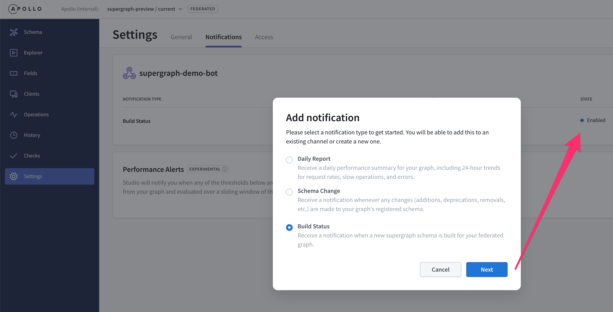
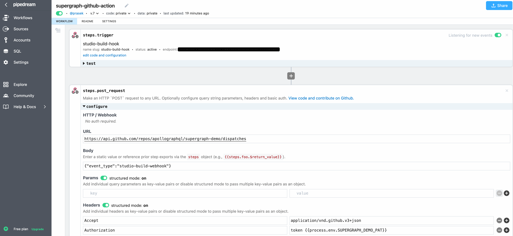
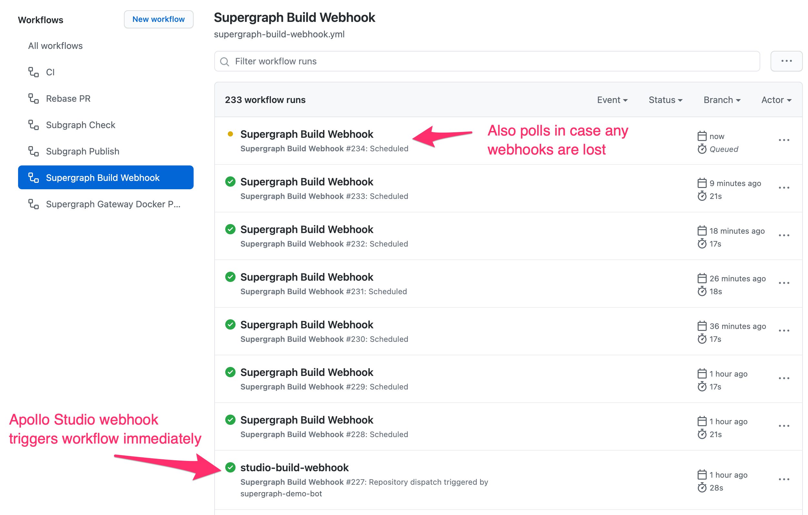
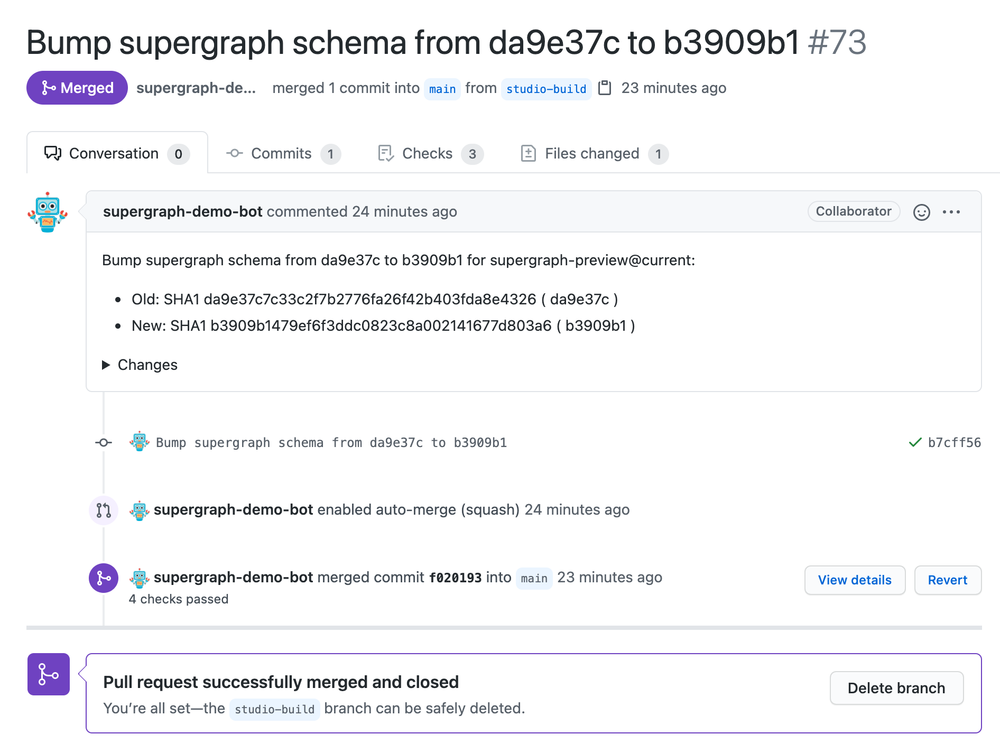

# Supergraph Demo


Moving from dynamic composition to static composition with supergraphs.

Contents:

* [Welcome](#welcome)
* [Prerequisites](#prerequisites)
* [Local Supergraph Composition](#local-supergraph-composition)
* [Composition in Apollo Studio](#composition-in-apollo-studio)
* [Ship Faster Without Breaking Changes](#ship-faster-without-breaking-changes)
* [CI Overview](#ci-overview)
* [CD Overview](#cd-overview)
* [Deploying to Kubernetes](#deploying-to-kubernetes)
* [Kubernetes-native GraphOps](#kubernetes-native-graphops)
* [Learn More](#learn-more)
* [Appendix: Detailed CI/CD Setup](#appendix-detailed-cicd-setup)

## Welcome

Apollo Federation and Managed Federation have delivered significant
improvements over schema stitching and alternate approaches. Static
composition introduces another big step forward as we move composition out of
the Gateway and into the CI pipeline where federated graph changes can be
validated sooner and built into static artifacts that define how a Gateway
should route requests across the subgraphs in a federation.

Most contemporary federated GraphQL implementations dynamically compose a
list of implementing services (subgraphs) into a GraphQL Gateway at runtime.
There is no static artifact that can be versioned, validated, or reasoned
about across a fleet of Gateway instances that are common in scale-out
federated graph deployments. Gateways often rely on hard-coded behavior for
directives like `join` or accept additional non-GraphQL configuration.

With static composition, you can compose subgraphs into a supergraph at
build-time resulting in a static artifact (supergraph schema) that describes
the machinery to power a graph router at runtime. The supergraph schema
includes directives like `join` that instruct a graph router how federate
multiple subgraphs into a single graph for consumers to use.


See also: [New Federation UX - Docs](https://www.apollographql.com/docs/federation/quickstart/)

## Prerequisites

You'll need:

* [docker](https://docs.docker.com/get-docker/)
* [docker-compose](https://docs.docker.com/compose/install/)
* `rover` [our new CLI](https://www.apollographql.com/docs/rover/getting-started)

To install `rover`:

```sh
curl -sSL https://rover.apollo.dev/nix/latest | sh
```

## Local Supergraph Composition

You can federate multiple subgraphs into a supergraph using:

```sh
make demo
```

which does the following:

```sh
# build a supergraph from 3 subgraphs: products, users, inventory
make supergraph
```

which runs:

```
rover supergraph compose --config ./supergraph.yaml > supergraph.graphql
```

and then runs:

```
docker-compose up -d

Creating router    ... done
Creating inventory ... done
Creating users     ... done
Creating products  ... done

Starting Apollo Gateway in local mode ...
Using local: supergraph.graphql
🚀 Graph Router ready at http://localhost:4000/
```

`make demo` then issues a curl request to the graph router via:

```sh
make query
```

which issues the following query that fetches across 3 subgraphs:

```ts
{
  query: {
    allProducts: {
      id,
      sku,
      createdBy {
        email,
        totalProductsCreated
      }
     }
  }
}
```

with results like:

```ts
{
  data: {
    allProducts: [
      {
        id: "apollo-federation",
        sku: "federation",
        createdBy: {
          email: "support@apollographql.com",
          totalProductsCreated: 1337
        }
      },{
        id: "apollo-studio",
        sku: "studio",
        createdBy:{
          email: "support@apollographql.com",
          totalProductsCreated: 1337
        }
      }
    ]
  }
}
```

`make demo` then shuts down the graph router:

```
docker-compose down
```

## Composition in Apollo Studio

[Managed Federation](https://www.apollographql.com/docs/federation/managed-federation/overview/) in Apollo Studio enables teams to independently publish subgraphs to the Apollo Registry, so they can be automatically composed into a supergraph for apps to use.

### Create a Federated Graph in Apollo Studio

To get started with Managed Federation, create your Apollo account:

* Signup for a free Team trial: https://studio.apollographql.com/signup
* Create an organization
* **Important:** use the `Team` trial which gives you access Apollo features like `Schema Checks`.

Then create a `Graph` of type `Deployed` with the `Federation` option.

Once you have created your graph in Apollo Studio, run the following:

```sh
make demo-managed
```

### Connect to your Graph in Apollo Studio

which will prompt for your `graph key` and `graph ref` and save them to `./graph-api.env`:

* `graph key` - the graph API key used to authenticate with Apollo Studio.
* `graph ref` - a reference to the graph in Apollo's registry the graph router should pull from.
  * in the form `<graph-id>@<variant>`
  * `@<variant>` is optional and will default to `@current`
  * examples: `my-graph@dev`, `my-graph@stage`, `my-graph@prod`
* see [configuration reference](https://www.apollographql.com/docs/apollo-server/api/apollo-server/#apollo) for details.

Note: The generated `./graph-api.env` holds your `APOLLO_KEY` and `APOLLO_GRAPH_REF`.

### Publish Subgraph Schemas to the Apollo Registry

`make demo-managed` will publish the `subgraphs/**.graphql` schemas to your new `Federated` graph in the Apollo Registry, which performs managed composition and schema checks, to prevent breaking changes:

```sh
make publish
```

Temporary composition errors may surface as each subgraph is published:

```
+ rover subgraph publish supergraph-router@dev --routing-url http://products:4000/graphql --schema subgraphs/products/products.graphql --name products

Publishing SDL to supergraph-router:dev (subgraph: products) using credentials from the default profile.

A new subgraph called 'products' for the 'supergraph-router' graph was created.

The gateway for the 'supergraph-router' graph was NOT updated with a new schema

WARN: The following composition errors occurred:
Unknown type "User".
[products] Query -> `Query` is an extension type, but `Query` is not defined in any service
```

Success! Once all subgraphs are published the supergraph will be updated, for example:

```
+ rover subgraph publish supergraph-router@dev --routing-url https://users:4000/graphql --schema subgraphs/users/users.graphql --name users

Publishing SDL to supergraph-router:dev (subgraph: users) using credentials from the default profile.

A new subgraph called 'users' for the 'supergraph-router' graph was created

The gateway for the 'supergraph-router' graph was updated with a new schema, composed from the updated 'users' subgraph
```

Viewing the `Federated` graph in Apollo Studio we can see the supergraph and the subgraphs it's composed from:


### Run the Graph Router and Subgraph Containers

The graph-router and subgraph services will be started by `make demo-managed` next.

using `docker-compose.managed.yml`:

```yaml
version: '3'
services:
  router:
    container_name: router
    build: ./router
    environment:
      - APOLLO_SCHEMA_CONFIG_DELIVERY_ENDPOINT=https://uplink.api.apollographql.com/
    env_file: # created with: make graph-api-env
      - graph-api.env
    ports:
      - "4000:4000"
  products:
    container_name: products
    build: ./subgraphs/products
  inventory:
    container_name: inventory
    build: ./subgraphs/inventory
  users:
    container_name: users
    build: ./subgraphs/users
```

```sh
make docker-up-managed
```

which shows:

```
docker-compose -f docker-compose.managed.yml up -d
Creating network "supergraph-demo_default" with the default driver
Creating graph-router ... done

Starting Apollo Gateway in managed mode ...
Apollo usage reporting starting! See your graph at https://studio.apollographql.com/graph/supergraph-router@dev/
🚀 Server ready at http://localhost:4000/
```

### Make a Federated Query

`make demo-managed` then issues a curl request to the graph router:

```sh
make query
```

which has the same query and response as above.

### Clean Up

`make demo-managed` then shuts down the graph router:

```sh
make docker-down
```

## Ship Faster Without Breaking Changes

Apollo Schema Checks help ensure subgraph changes don't break the federated graph, reducing downtime and enabling teams to ship faster.

### The Graph Router will Update In Place

With Managed Federation you can leave graph-router running and it will
update automatically when subgraph changes are published and they successfully
compose and pass all schema checks in Apollo Studio:

```sh
make docker-up-managed
```

```
Starting Apollo Gateway in managed mode ...
Apollo usage reporting starting! See your graph at https://studio.apollographql.com/graph/supergraph-router@dev/
🚀 Server ready at http://localhost:4000/
```

### Simulating a Change to the Product Subgraph

To simulate a change to the products subgraph, add a `Color` `enum` to `.subgraphs/products.graphql`:

```ts
enum Color {
  BLUE
  GREEN
}
```

Then `publish` the changes to the registry:

```sh
make publish
```

Then remove the `Color` `enum` from `.subgraphs/products.graphql`:

```ts
enum Color {
  BLUE
  GREEN
}
```

### Run a Schema Check

and do a schema `check` against the published version in the registry:

```sh
make check-products
```

This detects the schema changes, but compares them against the known graph `operations` and determines there is no impact and the changes can be published:

```sh
Checked the proposed subgraph against supergraph-demo@current
Compared 3 schema changes against 2 operations
┌────────┬─────────────────────────┬──────────────────────────────────────────┐
│ Change │          Code           │               Description                │
├────────┼─────────────────────────┼──────────────────────────────────────────┤
│ PASS   │ TYPE_REMOVED            │ type `Color`: removed                    │
├────────┼─────────────────────────┼──────────────────────────────────────────┤
│ PASS   │ VALUE_REMOVED_FROM_ENUM │ enum type `Color`: value `BLUE` removed  │
├────────┼─────────────────────────┼──────────────────────────────────────────┤
│ PASS   │ VALUE_REMOVED_FROM_ENUM │ enum type `Color`: value `GREEN` removed │
└────────┴─────────────────────────┴──────────────────────────────────────────┘
```

### Publish Validated Subgraph Schemas to Apollo Registry

Then `publish` the changes and `check` again:

```sh
make publish

make check-products
```

which shows:

```
Checked the proposed subgraph against supergraph-demo@current
There were no changes detected in the composed schema.
```

### Recap

Using `rover` in a local dev environment helps catch potentially breaking changes sooner. The next section covers how `rover` can be integrated into your CI/CD environments, and how Managed Federation catches breaking changes before they are delivered to the graph router.

## CI Overview

To enable concurrent service delivery in a multi-team environment, you can shift-left your schema checks to find errors that are often otherwise found at deploy time:

_CI_ for each subgraph:

* on code pull request:
  * `rover subgraph check`
* on config pull request:
  * `rover subgraph check`
* on config merge/push (after the subgraph service has been deployed):
  * `rover subgraph check`
  * `rover subgraph publish` - after a new version of a subgraph service is live
* [Managed Federation](https://www.apollographql.com/docs/federation/managed-federation/overview/)
  * Runs [schema checks](https://www.apollographql.com/docs/studio/schema-checks/) after each `rover subgraph publish`
  * Composes a supergraph schema if all checks pass
  * Makes the supergraph schema available in the:
    * Registry - for retrieval via `rover supergraph fetch`
    * Uplink - that the Gateway can poll for live updates.

Managed Federation doesn’t publish the composed supergraph schema until composition across all published subgraph succeed and schema checks pass.

With this approach, failed schema checks ([example](https://github.com/apollographql/supergraph-demo/pull/32)) are caught as close to the source of
the change as possible, but only fully validated supergraph schemas are
published for use.


Breaking changes are sometimes intentional, and to accommodate this, Apollo
Studio has the option to mark certain changes as safe in the UI, that provides a
check report URL in your CI, so you can easily navigate to Apollo Studio to:
review the check, mark things safe and then re-run your pipeline.


Publish changes with `rover subgraph publish` which stores a new subgraph schema version to the Apollo Registry, even if schema checks don’t pass. Managed Federation
composes published subgraphs and runs an additional set of
federated schema checks in a globally consistent way before the composed
supergraph schema is made available in the Apollo Registry and to the Apollo Uplink for the Gateway to use.

[Managed Federation](https://www.apollographql.com/docs/federation/managed-federation/overview/) ultimately catches all errors prior to publishing for use:

* CI for multiple concurrent `rover subgraph publish` from multiple service repos
* central point of control & governance
* globally consistent schema checks and composition
* ensures supergraph schema artifact is safe to use before it's published to the Registry

## CD Overview

Once CI has published a new supergraph schema artifact to the Registry it can be deployed via various Gateway _CD_ strategies:

* __(1) Update-in-place (default)__ - the Gateway fleet polls the Apollo Uplink for updates
  * updates in place with no downtime
  * works with all deployment types including VMs, Kubernetes, & Serverless
  * simple update option that helps rollout changes quickly to an existing Gateway fleet
* __(2) GitOps__ via extended CI
  * Auto-generate a new supergraph `ConfigMap` via `kustomize` when changes detected via:
    * [Supergraph build webhooks](https://www.apollographql.com/blog/announcement/webhooks/) - when a new supergraph schema is created
    * `rover supergraph fetch` - to poll the Registry for updates
  * Gateway `Deployment` references new supergraph schema `ConfigMap` via:
    * `kubectl apply` in place - resulting in a [rolling upgrade](https://github.com/kubernetes-sigs/kustomize/blob/master/examples/configGeneration.md)
    * Progressive delivery controllers like [Argo Rollouts](https://argoproj.github.io/argo-rollouts/) or [Flagger](https://flagger.app/)
  * Suitable for `BlueGreen` and `Canary` deployment strategies
  * Gateway `Deployments` can be rolled back to an earlier supergraph config:
    * Rollback to a `Deployment` that referenced an earlier supergraph `ConfigMap`

Both CD options are described in the appendix below.

## Deploying to Kubernetes

You'll need the latest versions of:

* [kubectl](https://kubernetes.io/docs/tasks/tools/) - with expanded `kustomize` support for `resources`
* [kind](https://kind.sigs.k8s.io/docs/user/quick-start/#installation)

then run:

```sh
make demo-k8s
```

which generates a graph router `Deployment` and supergraph `ConfigMap` using:

```
kubectl kustomize k8s/router/base
```

and then creates:

* local k8s cluster with the NGINX Ingress Controller
* graph-router `Deployment` configured to use a supergraph `ConfigMap`
* graph-router `Service` and `Ingress`

### Gateway Deployment with Supergraph ConfigMap

using [k8s/router/base/router.yaml](k8s/router/base/router.yaml) via:

```sh
kubectl apply -k k8s/router/base
```

```yaml
apiVersion: apps/v1
kind: Deployment
metadata:
  labels:
    app: router
  name: router-deployment
spec:
  replicas: 1
  selector:
    matchLabels:
      app: router
  template:
    metadata:
      labels:
        app: router
    spec:
      containers:
      - env:
        - name: APOLLO_SCHEMA_CONFIG_EMBEDDED
          value: "true"
        image: prasek/supergraph-router:latest
        name: router
        ports:
        - containerPort: 4000
        volumeMounts:
        - mountPath: /etc/config
          name: supergraph-volume
      volumes:
      - configMap:
          name: supergraph-c22698b7b9
        name: supergraph-volume
---
apiVersion: v1
kind: ConfigMap
metadata:
  name: supergraph-c22698b7b9
data:
  supergraph.graphql: |
    schema
      @core(feature: "https://specs.apollo.dev/core/v0.1"),
      @core(feature: "https://specs.apollo.dev/join/v0.1")
    {
      query: Query
    }

    ...

    enum join__Graph {
      INVENTORY @join__graph(name: "inventory" url: "http://inventory:4000/graphql")
      PRODUCTS @join__graph(name: "products" url: "http://products:4000/graphql")
      USERS @join__graph(name: "users" url: "https://users:4000/graphql")
    }

    type Product
      @join__owner(graph: PRODUCTS)
      @join__type(graph: PRODUCTS, key: "id")
      @join__type(graph: PRODUCTS, key: "sku package")
      @join__type(graph: PRODUCTS, key: "sku variation{id}")
      @join__type(graph: INVENTORY, key: "id")
    {
      id: ID! @join__field(graph: PRODUCTS)
      sku: String @join__field(graph: PRODUCTS)
      package: String @join__field(graph: PRODUCTS)
      variation: ProductVariation @join__field(graph: PRODUCTS)
      dimensions: ProductDimension @join__field(graph: PRODUCTS)
      createdBy: User @join__field(graph: PRODUCTS, provides: "totalProductsCreated")
      delivery(zip: String): DeliveryEstimates @join__field(graph: INVENTORY, requires: "dimensions{size weight}")
    }

    type ProductDimension {
      size: String
      weight: Float
    }

    type ProductVariation {
      id: ID!
    }

    type Query {
      allProducts: [Product] @join__field(graph: PRODUCTS)
      product(id: ID!): Product @join__field(graph: PRODUCTS)
    }

    type User
      @join__owner(graph: USERS)
      @join__type(graph: USERS, key: "email")
      @join__type(graph: PRODUCTS, key: "email")
    {
      email: ID! @join__field(graph: USERS)
      name: String @join__field(graph: USERS)
      totalProductsCreated: Int @join__field(graph: USERS)
    }
---
apiVersion: v1
kind: Service
metadata:
  name: router-service
spec:
  ports:
  - port: 4000
    protocol: TCP
    targetPort: 4000
  selector:
    app: router
---
apiVersion: networking.k8s.io/v1
kind: Ingress
metadata:
  annotations:
    kubernetes.io/ingress.class: nginx
  name: router-ingress
spec:
  rules:
  - http:
      paths:
      - backend:
          service:
            name: router-service
            port:
              number: 4000
        path: /
        pathType: Prefix
```

and 3 subgraph services [k8s/subgraphs/base/subgraphs.yaml](k8s/subgraphs/base/subgraphs.yaml) via:

```sh
kubectl kustomize k8s/subgraphs/base
```

### Make a GraphQL Query

`make demo-k8s` then runs the following in a loop until the query succeeds or 2 min timeout:

```sh
kubectl get all
make k8s-query
```

which shows the following:

```
NAME                                     READY   STATUS    RESTARTS   AGE
pod/inventory-65494cbf8f-bhtft           1/1     Running   0          59s
pod/products-6d75ff449c-9sdnd            1/1     Running   0          59s
pod/router-deployment-84cbc9f689-8fcnf   1/1     Running   0          20s
pod/users-d85ccf5d9-cgn4k                1/1     Running   0          59s

NAME                     TYPE        CLUSTER-IP      EXTERNAL-IP   PORT(S)    AGE
service/inventory        ClusterIP   10.96.108.120   <none>        4000/TCP   59s
service/kubernetes       ClusterIP   10.96.0.1       <none>        443/TCP    96s
service/products         ClusterIP   10.96.65.206    <none>        4000/TCP   59s
service/router-service   ClusterIP   10.96.178.206   <none>        4000/TCP   20s
service/users            ClusterIP   10.96.98.53     <none>        4000/TCP   59s

NAME                                READY   UP-TO-DATE   AVAILABLE   AGE
deployment.apps/inventory           1/1     1            1           59s
deployment.apps/products            1/1     1            1           59s
deployment.apps/router-deployment   1/1     1            1           20s
deployment.apps/users               1/1     1            1           59s

NAME                                           DESIRED   CURRENT   READY   AGE
replicaset.apps/inventory-65494cbf8f           1         1         1       59s
replicaset.apps/products-6d75ff449c            1         1         1       59s
replicaset.apps/router-deployment-84cbc9f689   1         1         1       20s
replicaset.apps/users-d85ccf5d9                1         1         1       59s
Smoke test
-------------------------------------------------------------------------------------------
++ curl -X POST -H 'Content-Type: application/json' --data '{ "query": "{ allProducts { id, sku, createdBy { email, totalProductsCreated } } }" }' http://localhost:80/
  % Total    % Received % Xferd  Average Speed   Time    Time     Time  Current
                                 Dload  Upload   Total   Spent    Left  Speed
100   352  100   267  100    85   3000    955 --:--:-- --:--:-- --:--:--  3911
{"data":{"allProducts":[{"id":"apollo-federation","sku":"federation","createdBy":{"email":"support@apollographql.com","totalProductsCreated":1337}},{"id":"apollo-studio","sku":"studio","createdBy":{"email":"support@apollographql.com","totalProductsCreated":1337}}]}}
Success!
-------------------------------------------------------------------------------------------
```

### Cleanup

`make demo-k8s` then cleans up:

```
deployment.apps "graph-router" deleted
service "graphql-service" deleted
ingress.networking.k8s.io "graphql-ingress" deleted
Deleting cluster "kind" ...
```

## Kubernetes-native GraphOps

Large-scale graph operators use Kubernetes to run their Graph Router and Subgraph Services, with continuous app and service delivery. Kubernetes provides a mature control-plane for deploying and operating your graph using the container images produced by this `source repo` -- which propagates new docker image versions to the [supergraph-demo-k8s-graphops](https://github.com/apollographql/supergraph-demo-k8s-graphops) `config repo`, with `kustomize` configs to deploy to Kubernetes for `dev`, `stage`, and `prod` environments.

## Learn More

Apollo tools and services help you develop, maintain, operate, and scale your data graph.

Learn more:

* [Shipping faster with managed federation and schema checks](https://www.apollographql.com/docs/studio/)
* [Kubernetes-native GraphOps](https://github.com/apollographql/supergraph-demo-k8s-graphops)

## Appendix: Detailed CI/CD Setup

### CI Setup

* Create [graph variants](https://www.apollographql.com/docs/studio/org/graphs/) in Apollo Studio for `dev`, `staging`, and `prod`:
* Configure [schema checks](https://www.apollographql.com/docs/studio/schema-checks/) for your graph:
  * [Federated composition checks](https://www.apollographql.com/docs/studio/schema-checks/#federated-composition-checks) will run against the subgraph schemas published to each variant.
  * [Operation checks](https://www.apollographql.com/docs/studio/schema-checks/#types-of-checks) should be configured to validate real world [schema usage](https://www.apollographql.com/docs/studio/check-configurations/#using-apollo-studio-recommended) with usage data from `staging` and `prod` variants.
  * Configure Gateway deployments to provide [usage reporting](https://www.apollographql.com/docs/apollo-server/api/plugin/usage-reporting/#gatsby-focus-wrapper) data for operation checks.

* For each graph variant: `dev`, `staging`, and `prod`:
  * config pull requests: [subgraph-check.yml](https://github.com/apollographql/supergraph-demo/blob/main/.github/workflows/subgraph-check.yml)
    * `rover subgraph check`
  * config merge/push: [subgraph-publish.yml](https://github.com/apollographql/supergraph-demo/blob/main/.github/workflows/subgraph-publish.yml)
    * run after the subgraph service has been deployed
    * `rover subgraph check`
    * `rover subgraph publish`
  * Managed Federation
    * Runs schema checks after each `rover subgraph publish`
    * Composes a supergraph schema if all checks pass
    * Makes the supergraph schema available in the:
      * Registry - for retrieval via `rover supergraph fetch`
      * Uplink - that the Gateway can poll for live updates.

* If you’re in a monorepo:
  * Consider using 3-way merges and [overriding the APOLLO_VCS_COMMIT and/or APOLLO_VCS_BRANCH](https://www.apollographql.com/docs/rover/configuring/#overriding) to correlate schema changes for subgraphs.

### CD: Update Gateway In Place

The default Gateway configuration for Managed Federation is to update the Gateway in place when a new supergraph schema is published to the Uplink. Gateways in the fleet poll the Uplink every 10 seconds by default, so there will be a fast rolling upgrade as Gateways check the Uplink, without the need to restart the Gateway.

Update in place is useful for any long-lived Gateway instance where an immediate update of the Gateway instance's supergraph schema is desired. This is useful for long-lived VMs, Kubernetes `Deployments`, or even Serverless functions that may be cached outside of operator control.

Steps:

* [Configure the Gateways in each fleet](https://www.apollographql.com/docs/federation/managed-federation/setup/#3-modify-the-gateway-if-necessary) (`dev`, `staging`, `prod`) to:
  * pull supergraph schema from their respective graph variants, via the [Apollo Uplink](https://www.apollographql.com/docs/federation/quickstart-pt-2/#managed-federation-basics).
  * provide [usage reporting](https://www.apollographql.com/docs/apollo-server/api/plugin/usage-reporting/#gatsby-focus-wrapper) data for operation checks.

### CD: GitOps via Extended CI

A new supergraph `ConfigMap` is generated using `kustomize` when changes are detected via:
* [Supergraph build webhooks](https://www.apollographql.com/blog/announcement/webhooks/) - when a new supergraph schema is created
* `rover supergraph fetch` - to poll the Registry for updates

An updated Gateway `Deployment` references new supergraph schema `ConfigMap` via:
* `kubectl apply` in place - resulting in a [rolling upgrade](https://github.com/kubernetes-sigs/kustomize/blob/master/examples/configGeneration.md)
* Progressive delivery controllers like [Argo Rollouts](https://argoproj.github.io/argo-rollouts/) or [Flagger](https://flagger.app/)
* Suitable for `BlueGreen` and `Canary` deployment strategies

Gateway `Deployments` can be rolled back to an earlier supergraph schema by applying an earlier version of the Gateway `Deployment` that referenced an earlier supergraph `ConfigMap`.

To produce the new supergraph schema `Config Map`, this option extends the CI steps above:

1. Detect changes to the supergraph schema built via Managed Federation in Apollo Studio
2. Create a PR to bump [supergraph.graphql](supergraph.graphql) so Git is a source of truth
3. Generate a new supergraph `ConfigMap` and associated Gateway `Deployment`

The resulting Gateway configuration can be applied directly with `kubectl`, with GitOps, and/or using `BlueGreen` and `Canary` deployments with a progressive delivery controller.

#### Extended CI Steps

1. Detecting changes to the supergraph built via Managed Federation

   * Managed Federation builds a supergraph schema after each `rover subgraph publish`
   * Changes detected with the following:
     * [Supergraph build webhooks](https://www.apollographql.com/blog/announcement/webhooks/) - when a new supergraph schema is built in Apollo Studio
     * `rover supergraph fetch` - to poll the Registry

2. `Bump supergraph schema` PR with auto-merge enabled when changes detected
   * Workflow: [supergraph-build-webhook.yml](https://github.com/apollographql/supergraph-demo/blob/main/.github/workflows/supergraph-build-webhook.yml)
   * Commits a new [supergraph.graphql](supergraph.graphql) with the new version from Apollo Studio
   * Additional CI checks on the supergraph schema are required for the PR to merge
   * Auto-merged when CI checks pass

3. Generate a new Gateway `Deployment` and `ConfigMap` using `kustomize`
   * Once changes to `supergraph.graphql` when `Bump supergraph schema` is merged
   * Typically in a separate config repo

#### Extended CI Steps (Details)

1. Register the webhook in Apollo Studio in your graph settings
   * Send the webhook to an automation service or serverless function:
   * 

2. Adapt the webhook to a GitHub `repository_dispatch` POST request
   * Create a webhook proxy that passes a `repo` scoped personal access token (PAT)
   * Using a [GitHub machine account](https://github.com/peter-evans/create-pull-request/blob/main/docs/concepts-guidelines.md#workarounds-to-trigger-further-workflow-runs) with limited access:
   * 

3. `repository_dispatch` event triggers a GitHub workflow
   * [supergraph-build-webhook.yml](https://github.com/apollographql/supergraph-demo/blob/main/.github/workflows/supergraph-build-webhook.yml)
   * uses both `repository_dispatch` and `scheduled` to catch any lost webhooks:
   * 

4. GitHub workflow automatically creates a PR with auto-merge enabled
   * [supergraph-build-webhook.yml](https://github.com/apollographql/supergraph-demo/blob/main/.github/workflows/supergraph-build-webhook.yml)
   * using a GitHub action like [Create Pull Request](https://github.com/marketplace/actions/create-pull-request) - see [concepts & guidelines](https://github.com/peter-evans/create-pull-request/blob/main/docs/concepts-guidelines.md)
   * 
   * uses `kustomize` to generate:
     * a new supergraph schema `ConfigMap`
     * a new Gateway `Deployment` that references the new `ConfigMap`

5. Apply the updated Gateway `Deployment` and supergraph `ConfigMap`